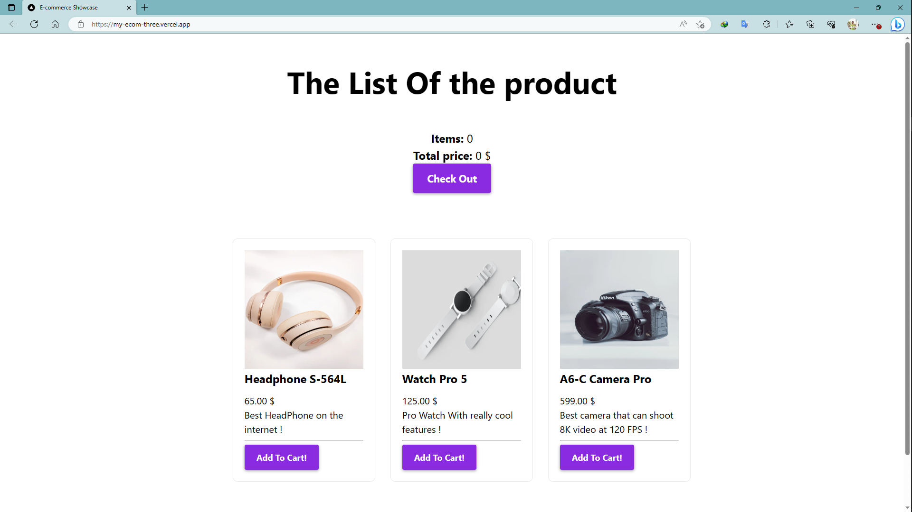

# Ecommerce Website

This is a simple e-commerce page built using Next.js, React, and Stripe for payment processing.

## Prerequisites

Make sure you have the following software installed before running the project:

- Node.js (version 14 or above)
- npm (version 6 or above)

## Getting Started

Follow the steps below to get the project up and running on your local machine:

1. Clone the repository:

   <pre>
   <code>
   git clone https://github.com/Zo-ambinintsoa/egg-app.git
   </code>
   </pre>

2. Navigate to the project directory:

   <pre>
   <code>
   cd egg-app
   </code>
   </pre>

3. Install the dependencies:

   <pre>
   <code>
   npm install
   </code>
   </pre>

4. Configure Stripe:

   - Sign up for a Stripe account at [https://dashboard.stripe.com/register](https://dashboard.stripe.com/register).
   - Obtain your Stripe API keys (publishable key and secret key).
   - Update the Stripe API keys in the project's configuration file (usually located in `src/config.js`).

5. Start the development server:

   <pre>
   <code>
   npm run dev
   </code>
   </pre>

6. Open your web browser and visit [http://localhost:3000](http://localhost:3000) to see the e-commerce website.

## Features

- Browse and search for products.
- Add products to the shopping cart.
- View and edit the shopping cart.
- Proceed to checkout and make a payment using Stripe.

## Dependencies

The project relies on the following dependencies:

- [@stripe/stripe-js](https://www.npmjs.com/package/@stripe/stripe-js) (v1.35.0): Stripe JavaScript library for client-side integration.
- [next](https://nextjs.org/) (v12.2.5): Framework for server-rendered React applications.
- [react](https://reactjs.org/) (v18.2.0): JavaScript library for building user interfaces.
- [react-dom](https://reactjs.org/docs/react-dom.html) (v18.2.0): Package provides DOM-specific methods for React.

You can install these dependencies by running the following command:

<pre>
<code>
npm install
</code>
</pre>

## License

This project is licensed under the MIT License. See the [LICENSE](LICENSE) file for more information.

## Acknowledgements

- [Next.js Documentation](https://nextjs.org/docs)
- [React Documentation](https://reactjs.org/docs)
- [Stripe Documentation](https://stripe.com/docs)

Feel free to customize and modify the project to fit your needs. Happy coding!

